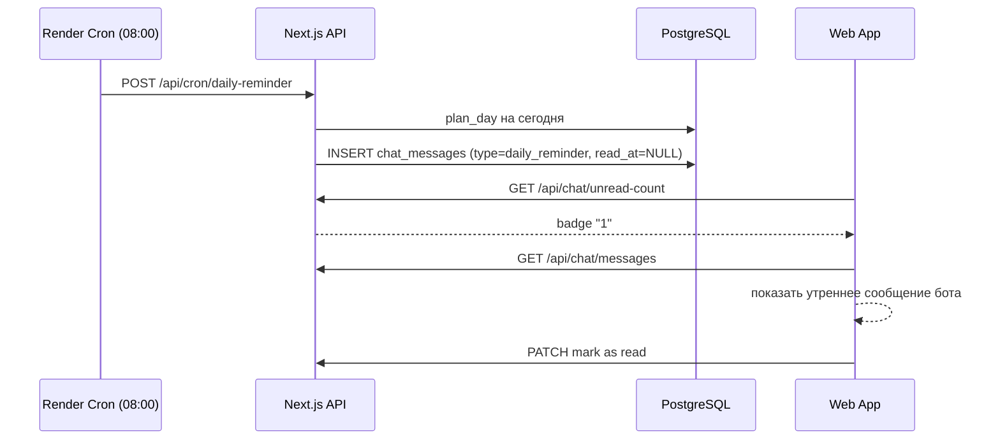

# FoodFox MVP v0.1 — Web + Chat Bot

Цель: клиент загружает FOX PDF → видит зоны → зелёные продукты → рецепты → 8-недельный план → общается с ботом → получает напоминания **внутри приложения**.

## Стек (утверждено)

| Слой | Технология | Где |
|------|------------|-----|
| Web UI + API | Next.js 14 | Render Web Service |
| **БД** | **PostgreSQL 16 (своя)** | **Render Postgres** |
| Миграции | SQL files / Drizzle ORM | repo `packages/database/` |
| Файлы PDF | S3-compatible (R2 / MinIO) | метаданные в Postgres |
| **LLM** | **getheli.ru** (OpenAI-compatible) | env `HELI_*` |
| **Push v0.1** | **In-app only** | сообщения бота в чате + badge unread |
| Cron (опционально) | Render Cron | генерирует утренние сообщения в `chat_messages` |

**Не используем:** Supabase, OpenAI напрямую, Web Push, Telegram, email.

---

## Своя БД — задел на будущее

```
packages/database/
├── migrations/          # версионированные SQL
├── schema.sql           # актуальная схема
└── seeds/               # 286 продуктов FOX, рецепты
```

Принципы:
- **UUID** для всех PK (масштабирование, шардинг позже)
- **`tenant_id`** nullable — задел под клиники/нутрициологов
- **`created_at` / `updated_at`** везде — big data, аналитика
- **JSONB** для сырых данных парсера (не ломаем схему при смене PDF)
- **Row-level isolation** по `client_id` на уровне API (не LLM)
- Отдельные таблицы событий `analytics_events` для кликов, открытий рецептов

### Ядро схемы (v0.1)

```sql
-- Пользователи и клиенты
users (id, email, password_hash, role, created_at)
clients (id, user_id, tenant_id, display_name, metadata jsonb)

-- FOX отчёты
reports (id, client_id, storage_key, status, metadata jsonb, parse_confidence)
test_results (id, report_id, food_item_id, value_ug_ml, zone, raw jsonb)

-- Справочник
food_items (id, fox_name, category_id, aliases jsonb)
food_categories (id, name_ru, sort_order)
recipes (id, title, steps jsonb, published)
recipe_ingredients (recipe_id, food_item_id, amount)

-- План 8 недель
nutrition_plans (id, client_id, report_id, started_at, weeks_total default 8)
plan_days (id, plan_id, date, week_number, allowed jsonb, forbidden jsonb, bot_message text)

-- Чат и in-app «push»
chat_threads (id, client_id, plan_id)
chat_messages (id, thread_id, role, content, message_type, read_at, created_at)
-- message_type: user | assistant | daily_reminder | system

-- Big data / аналитика
analytics_events (id, client_id, event_type, payload jsonb, created_at)

-- LLM audit (опционально, для отладки и billing)
llm_requests (id, client_id, model, tokens_in, tokens_out, latency_ms, created_at)
```

---

## Heli (getheli.ru) — LLM gateway

Heli — прокси ко **всем моделям** через **OpenAI-compatible API**.

```typescript
// lib/llm/heli.ts
import OpenAI from 'openai';

export const heli = new OpenAI({
  apiKey: process.env.FOX_HELI_API_KEY!,
  baseURL: process.env.HELI_BASE_URL!, // из личного кабинета getheli.ru, обычно .../v1
});

// Чат
const response = await heli.chat.completions.create({
  model: process.env.HELI_CHAT_MODEL ?? 'gpt-4o-mini', // любая модель из каталога Heli
  messages: [
    { role: 'system', content: buildSystemPrompt(clientContext) },
    ...history,
    { role: 'user', content: userMessage },
  ],
});
```

### Env vars

```env
FOX_HELI_API_KEY=sk-...                    # ключ из личного кабинета getheli.ru
HELI_BASE_URL=https://getheli.ru/v1    # адрес API (OpenAI-compatible), см. ниже
HELI_CHAT_MODEL=gpt-4o-mini             # любая модель из каталога Heli
```

### Что такое HELI_BASE_URL?

Это **адрес сервера API**, куда приложение шлёт запросы к нейросетям — аналог `https://api.openai.com/v1`, но через Heli.

Heli — прокси с OpenAI-совместимым протоколом: в коде используется обычный OpenAI SDK, просто меняются `apiKey` и `baseURL`.

| Переменная | Значение |
|------------|----------|
| `FOX_HELI_API_KEY` | Ваш ключ после «Получить ключ» на [getheli.ru](https://getheli.ru) |
| `HELI_BASE_URL` | **`https://getheli.ru/v1`** (проверено: endpoint `/v1/models` отвечает 401 без ключа — значит живой) |

Пример проверки ключа:

```bash
curl https://getheli.ru/v1/models \
  -H "Authorization: Bearer ВАШ_FOX_HELI_API_KEY"
```

### Выбор модели

| Задача | Модель через Heli | Почему |
|--------|-------------------|--------|
| Чат, FAQ, напоминания | `gpt-4o-mini` или аналог | дёшево, быстро |
| Сложная интерпретация FOX | `claude-sonnet-*` / `gpt-4o` | точнее |
| Парсинг PDF (v0.2) | `gpt-4o` + structured output | валидация 286 позиций |

**Память бота — не в LLM.** Каждый запрос:
1. Загрузить контекст из Postgres (`test_results`, `plan_days`, последние 20 `chat_messages`)
2. Собрать system prompt (disclaimer FOX + KB tone)
3. Вызвать Heli
4. Сохранить ответ в `chat_messages` + audit в `llm_requests`

---

## In-app push (без внешних каналов)



Пользователь **не получает push на телефон** — видит напоминание при входе:
- Badge на иконке «Чат»
- Новое сообщение от бота в ленте
- Опционально: banner «Доброе утро! Сегодня можно: …»

Cron нужен только чтобы **сгенерировать** сообщение в БД. Без cron можно показывать «сегодняшний plan_day» при открытии чата — ещё проще для v0.1.

---

## Хранение PDF (без Supabase)

| Вариант | MVP | Production |
|---------|-----|------------|
| **Cloudflare R2** | ✅ рекомендуем | дёшево, S3 API |
| MinIO self-hosted | dev | полный контроль |
| BYTEA в Postgres | только demo | не масштабируется |

В `reports.storage_key` храним путь: `reports/{client_id}/{report_id}.pdf`.

---

## Render Blueprint

```yaml
databases:
  - name: foodfox-db
    plan: basic-256mb   # MVP, потом scale

services:
  - type: web
    name: foodfox-web
    runtime: node
    envVars:
      - key: DATABASE_URL
        fromDatabase:
          name: foodfox-db
          property: connectionString
      - key: FOX_HELI_API_KEY
        sync: false
      - key: HELI_BASE_URL
        sync: false
      - key: S3_ENDPOINT / S3_BUCKET / S3_ACCESS_KEY
        sync: false

  - type: cron
    name: foodfox-daily-reminder
    schedule: "0 5 * * *"   # 08:00 MSK — создаёт сообщение в чате
```

---

## Экраны v0.1 (4 штуки)

1. **Загрузка отчёта** — PDF → S3 + парсинг
2. **Мои результаты** — 🟢🟡🔴 фильтр
3. **Зелёные + рецепты**
4. **Чат** — бот + daily reminders + badge unread

---

## Порядок разработки (маленькие шаги)

| # | Шаг | Стек |
|---|-----|------|
| 1 | Postgres schema + migrate на Render | SQL / Drizzle |
| 2 | Next.js skeleton + health | Render deploy |
| 3 | Upload PDF → S3 + reports table | |
| 4 | Parser → test_results | Python worker или API route |
| 5 | Зелёные + seed рецепты | |
| 6 | Plan Engine 8 недель → plan_days | |
| 7 | Heli chat + chat_messages | |
| 8 | In-app reminders (cron или on-open) | |

**Solo + Cursor: 3–4 недели** до демо клиенту.

---

## Что нужно от вас сейчас

1. **HELI_BASE_URL** и **FOX_HELI_API_KEY** из личного кабинета getheli.ru
2. **S3/R2** bucket (или временно парсим без хранения — только in-memory для POC)
3. Подтверждение: **cron утром** или **reminder при открытии чата** для v0.1 (cron можно отложить)
